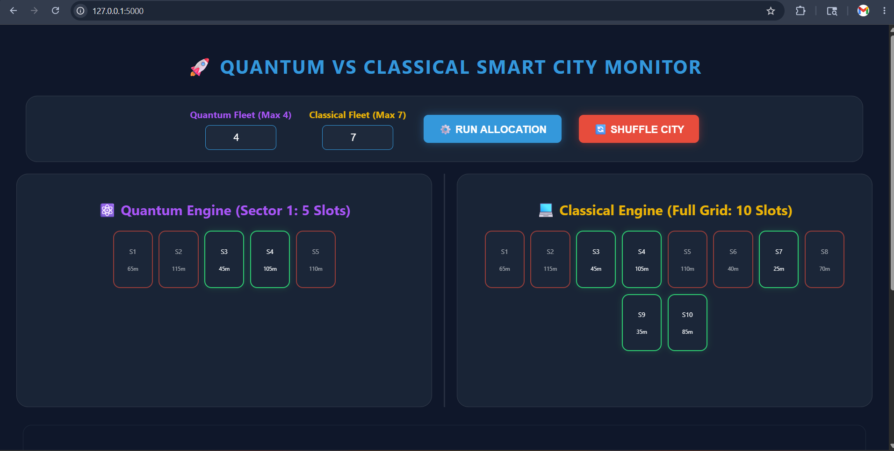
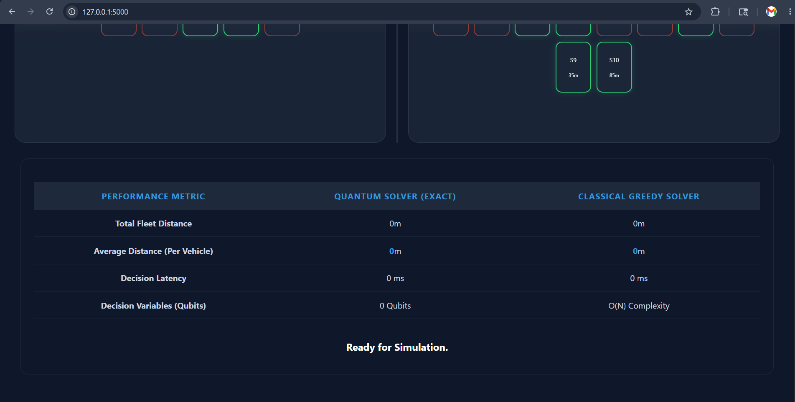
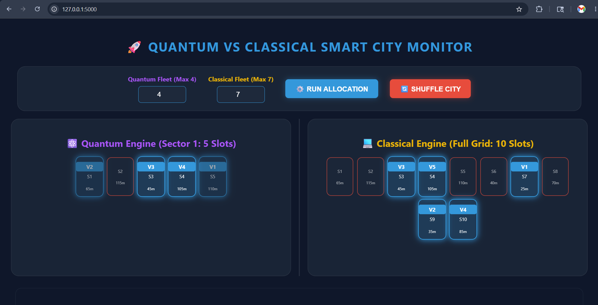

# 🚀 Quantum Smart Parking Simulation

[](https://www.python.org/)
[](https://qiskit.org/)
[](https://flask.palletsprojects.com/)
[](https://opensource.org/licenses/MIT)

A **Quantum-Classical Hybrid System** designed to solve urban parking congestion using advanced mathematical optimization. This project models the smart city parking allocation problem as a **Quadratic Unconstrained Binary Optimization (QUBO)** task and solves it using a Quantum Minimum Eigensolver.

It features a live, interactive dashboard that compares the efficiency of a **Quantum Engine (Global Optimization)** against a traditional **Classical Engine (Greedy Search)** in real-time.

---

## ✨ Key Features
* **Global Quantum Optimization:** Evaluates $2^n$ possible parking statevectors simultaneously to find the absolute minimum total fleet distance.
* **Classical vs. Quantum Benchmarking:** Live comparison showing how greedy algorithms fail in congested environments while quantum logic thrives.
* **Hardware-Aware Execution:** Strategically limits the quantum simulation sector to prevent classical RAM overload (safely running 20 qubits on 16GB RAM).
* **Interactive City Simulator:** An on-demand traffic simulator that shuffles distances and parking availability to mimic real-world IoT sensor data.

---

## 📸 Output & Screenshots

### 1. Interactive Control Room Dashboard
*(Displays the split-view comparison between the Quantum Sector and the Full Classical Grid)*


### 2. Real-Time Efficiency Analytics
*(Shows the dynamic calculation of Total Fleet Distance, Average Distance Per Vehicle, and Decision Latency)*


### 3. Simulator & Solver Terminal Logs
*(Demonstrates the background traffic simulator and the exact Quantum Solver hardware checks)*


> **Note:** To see the UI in action, clone the repository and run the simulation locally!

---

## ⚙️ Installation & Setup

Follow these steps to set up the quantum simulation environment on your local machine.

**1. Clone the repository**
```bash
git clone [https://github.com/PanabakaMahesh/Quantum-Smart-Parking-Simulation.git](https://github.com/PanabakaMahesh/Quantum-Smart-Parking-Simulation.git)
cd Quantum-Smart-Parking-Simulation

**2. Create a virtual environment**

python3 -m venv venv

**3. Activate the virtual environment**

For Linux/macOS:
source venv/bin/activate

For Windows:
venv\Scripts\activate

**4. Upgrade PIP &** **Install Dependencies**

pip install --upgrade pip
pip install -r requirements.txt

**5. Run the Application**

python main.py